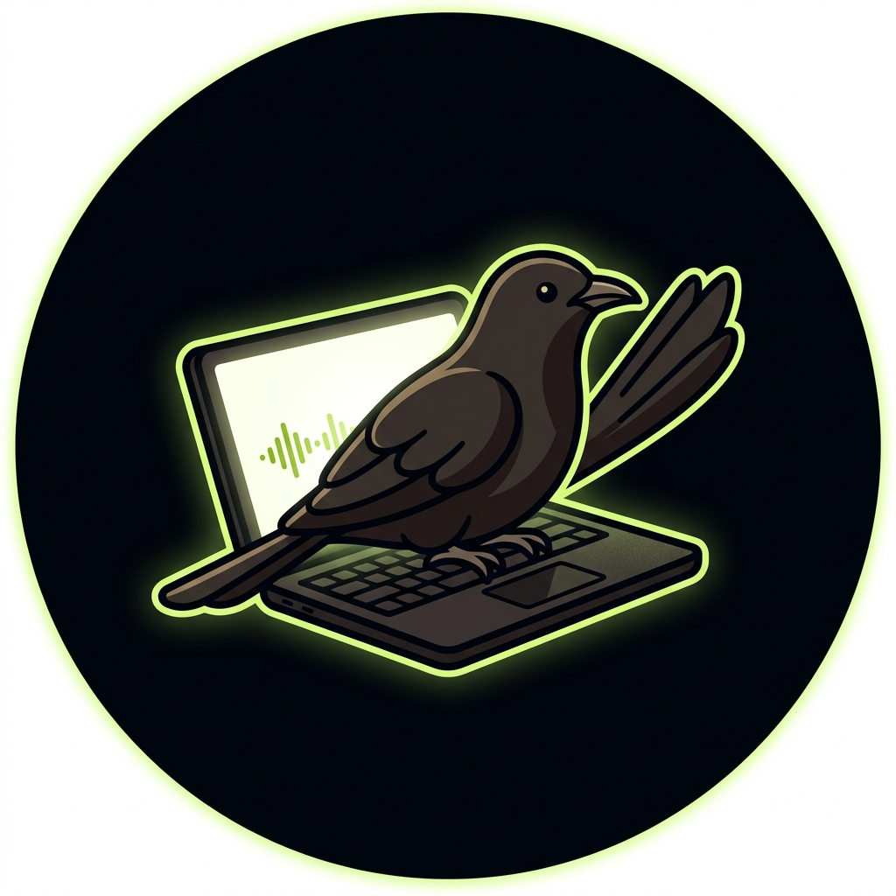

<div align="center">
  
  <h1>Koyal</h1>
  <p><em>You talk. Koyal transcribes.</em></p>
  <p>
    
    
    
  </p>
</div>

---

Koyal is a **fully offline, privacy-first voice transcription app** for Windows and Android. Powered by OpenAI Whisper and CrisperWhisper. No cloud. No subscription. No data collection.

## Features

- **100% offline** — your voice never leaves your device
- **Two AI models** — Koyal Lite (whisper-small, 466MB) and Koyal Medium (CrisperWhisper, 1.5GB)
- **Windows** — hold `C` to record anywhere, text injected at cursor
- **Android** — floating bubble appears in every text field
- **Transcription history** — searchable, exportable local database
- **Cozy dark theme** — deep black with botanical patterns

## Repo Structure

```
Koyal/
├── koyal-windows/     # Python Windows app
├── koyal-android/     # Kotlin Android app
├── koyal-website/     # Landing page (HTML/CSS/JS)
├── docs/
│   └── USAGE_RULE.md  # How to use on PC and mobile
└── README.md
```

## Setup

See [docs/USAGE_RULE.md](docs/USAGE_RULE.md) for full setup instructions.

## Models

| Model | Engine | Size | Best for |
|-------|--------|------|----------|
| Koyal Lite | openai/whisper-small | 466 MB | Everyday use |
| Koyal Medium | nyrahealth/CrisperWhisper | 1.5 GB | Precision work |

## License

MIT — free to use, modify, and share.
