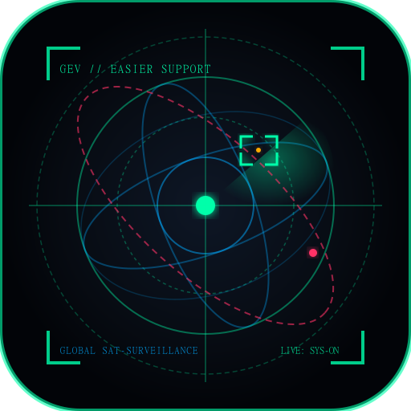

# Gods Eye Veiw Easier support

<p align="center">
  
</p>

<p align="center">
  <strong>Windows Desktop Edition of God's Eye View</strong><br/>
  Live 3D geospatial intelligence on a photorealistic globe — now as an easy one-click Windows app.
</p>

<p align="center">
  <a href="https://github.com/aryanisproinroblox-source/Gods-Eye-Veiw-Easier-support/releases/latest">
    
  </a>
  <a href="LICENSE">
    
  </a>
  
</p>

---

## ⚠️ Full Credit & Attribution

> **This project is built entirely upon the brilliant work of [Bilawal Sidhu](https://github.com/bilawalsidhu).**
>
> The original **God's Eye View** — the 3D globe, all spatial intelligence layers (aircraft, satellites, maritime, CCTV, wildfires, earthquakes, AI voice copilot, and all data integrations) — was conceived, designed, and built by **Bilawal Sidhu**.
>
> 🔗 **Original Repository:** https://github.com/bilawalsidhu/gods-eye-view
> 📄 **License:** MIT © Bilawal Sidhu
>
> This repository **only adds** a Windows Electron desktop wrapper ("Easier Support") for convenience.
> All core application credit belongs to Bilawal Sidhu and the upstream open data providers.

---

## What is Gods Eye Veiw Easier support?

This is the **Windows Desktop Edition** of [God's Eye View](https://github.com/bilawalsidhu/gods-eye-view) — packaged as a native Windows `.exe` installer so you don't need to touch the terminal at all.

### What it gives you vs. the original
| Feature | Original (browser) | This Windows app |
|---|---|---|
| Install method | `npm install` + `npm run dev` | One-click `.exe` installer |
| Desktop shortcut | ❌ | ✅ Desktop + Start Menu |
| GPU acceleration | Browser default | Forced WebGL + GPU flags |
| Single instance lock | ❌ | ✅ |
| Native app menu | ❌ | ✅ (View, Help, Credits) |
| In-app Credits window | ❌ | ✅ Shows Bilawal Sidhu credit |
| About dialog | ❌ | ✅ |

---

## Download

Go to [**Releases**](https://github.com/aryanisproinroblox-source/Gods-Eye-Veiw-Easier-support/releases/latest) and download:

- **`Gods Eye Veiw Easier support-Setup-1.0.0.exe`** — NSIS Windows installer (recommended)
- **`Gods Eye Veiw Easier support-1.0.0-portable.exe`** — Portable, no install needed

---

## Features (Original God's Eye View)

All features are from the original project by Bilawal Sidhu:

- 🌍 **Photorealistic 3D Globe** via CesiumJS + Google 3D Tiles
- ✈️ **Live Aircraft** — OpenSky, ADS-B, cockpit view cameras
- 🛰️ **Orbital Satellites** — real-time ISS & 10,000+ objects via CelesTrak
- 🚢 **Maritime Vessels** — AIS live ship tracking
- 🔥 **Active Wildfires** — NASA FIRMS thermal hotspots
- 📹 **Municipal CCTV** — live traffic cameras worldwide
- 🌊 **Earthquakes** — real-time seismic events
- 🗺️ **Traffic** — TomTom live road conditions
- 🎙️ **AI Voice Copilot** — OpenAI Realtime (BYOK)
- 🌙 **Sensor Modes** — Night Vision, FLIR/Thermal, CRT, Noir HUD

---

## Setup & API Keys

Most features work without any API keys. For the full experience, optionally add:

| API Key | Unlocks | Get Free Key |
|---|---|---|
| Google Maps Platform | Photorealistic 3D planet | [console.cloud.google.com](https://console.cloud.google.com) |
| Cesium ion | 3D terrain | [ion.cesium.com](https://ion.cesium.com) |
| OpenAI | AI voice copilot | [platform.openai.com](https://platform.openai.com) |
| AISStream | Live ship AIS | [aisstream.io](https://aisstream.io) |
| NASA FIRMS | Wildfire data | [firms.modaps.eosdis.nasa.gov](https://firms.modaps.eosdis.nasa.gov) |
| TomTom | Traffic overlay | [developer.tomtom.com](https://developer.tomtom.com) |

In the app, open the **Provider Settings** panel (gear icon) to enter keys — no terminal needed.

---

## Building from Source

Requirements: **Node.js 24.14+**, **npm 11+**

```bash
# Clone
git clone https://github.com/aryanisproinroblox-source/Gods-Eye-Veiw-Easier-support.git
cd Gods-Eye-Veiw-Easier-support

# Install dependencies
npm install

# Run in development (opens Electron window)
npm run electron

# Build Windows installer
npm run build:win
# Output: dist-electron/Gods Eye Veiw Easier support-Setup-1.0.0.exe
```

---

## Open Data Sources & Upstream Credits

All data integrations are powered by open public APIs. Full details in the original [`DATA_SOURCES.md`](DATA_SOURCES.md) by Bilawal Sidhu.

| Provider | Data |
|---|---|
| OpenSky Network | Live aircraft ADS-B/Mode-S telemetry |
| CelesTrak | Satellite TLE orbital elements |
| AISStream | Maritime vessel AIS positions |
| NASA FIRMS | Active wildfire thermal detections |
| TomTom | Real-time traffic incidents & flow |
| Launch Library 2 | Orbital rocket missions |
| Radio Browser | Community worldwide radio stations |

---

## License

The core application code is **MIT © Bilawal Sidhu**.

Third-party datasets bundled in the original project carry their own licenses — see [`DATA_SOURCES.md`](DATA_SOURCES.md) for full details.

The Windows Electron packaging additions in this repository are also MIT licensed.

---

## Disclaimer

This is an OSINT research and visualization tool. Data may be delayed, incomplete, or modeled. **Do not use for aviation, maritime navigation, or emergency response.** See [`SECURITY.md`](SECURITY.md) from the original project for full terms.
